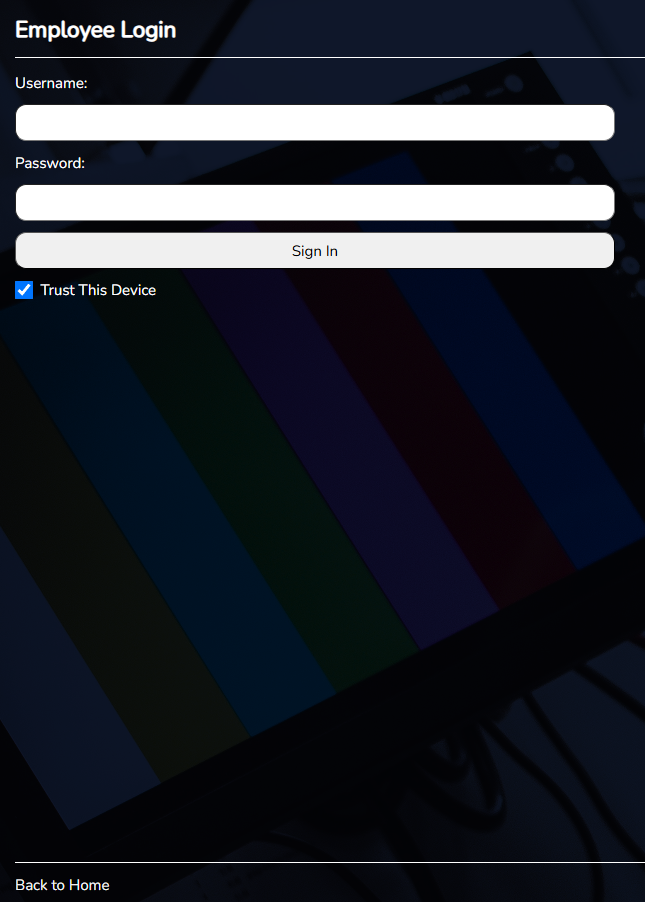

# Notes Management System

A web-based application for managing notes in a work environment. This project features a separate backend and frontend architecture.

## Table of Contents
- [Features](#features)
- [Tech Stack](#tech-stack)
- [Installation](#installation)
- [Usage](#usage)
- [Roles and Permissions](#roles-and-permissions)
- [Screens and Navigation](#screens-and-navigation)
- [Contributing](#contributing)
- [License](#license)

## Features
- **Replace Sticky Note System:** A modern solution to organize notes efficiently.
- **Public Facing Page:** Provides basic contact information.
- **Employee Login:** Secure login system with weekly login requirement.
- **Welcome Page:** Displays a welcome message and essential navigation links after login.
- **Easy Navigation:** Intuitive user interface for smooth operation.
- **User Display:** Shows the current user's name and role.
- **Logout Option:** Securely logout from the system.
- **Access Management:** Remove user access promptly if required.
- **Notes Management:**
  - Notes include a ticket number, title, body, and timestamps for creation and updates.
  - Notes have two statuses: OPEN or COMPLETED.
  - Notes are assigned to specific users.
- **User Roles:**
  - **Employees:** View and edit their assigned notes.
  - **Managers and Admins:** Full access to all notes and user settings.
  - Only Managers and Admins can create or delete users and notes.
- **Mobile and Desktop Support:** Prioritizes desktop usability but supports mobile devices.

## Tech Stack
- **Frontend:** React.js, React Router, Redux
- **Backend:** Node.js, Express.js
- **Database:** MongoDB
- **Other Tools:** React Query, JWT Authentication, bcrypt for password security

## Installation
### Backend Setup
1. Navigate to the `backend` directory.
2. Install dependencies:
   ```bash
   npm install
   ```
3. Set up environment variables:
   - `MONGO_URI`: MongoDB connection string
   - `JWT_SECRET`: Secret key for JWT
4. Start the server:
   ```bash
   npm start
   ```

### Frontend Setup
1. Navigate to the `frontend` directory.
2. Install dependencies:
   ```bash
   npm install
   ```
3. Start the development server:
   ```bash
   npm start
   ```

## Usage
1. Access the application in your browser:
   - Public page: `/`
   - Login: `/login`
   - Dashboard: `/dashboard`
2. Login with employee, manager, or admin credentials.
3. Use the dashboard to manage notes and user settings as per your role.

## Roles and Permissions
- **Employees:**
  - Create, view, and edit their assigned notes.
- **Managers and Admins:**
  - Full access to all notes.
  - Create and delete notes.
  - Manage user settings.
  - Remove user access immediately if necessary.

## Screens and Navigation
- **Login Page:** Secure authentication for employees.
- **Notes Management:**
  - Add, edit, view, or delete notes based on permissions.
 



## Contributing
1. Fork the repository.
2. Create a feature branch:
   ```bash
   git checkout -b feature-name
   ```
3. Commit changes and push:
   ```bash
   git commit -m "Add feature"
   git push origin feature-name
   ```
4. Create a pull request.

## License
This project is licensed under the MIT License. See the LICENSE file for details.
